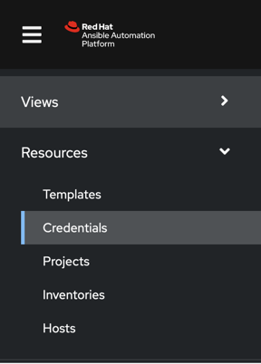
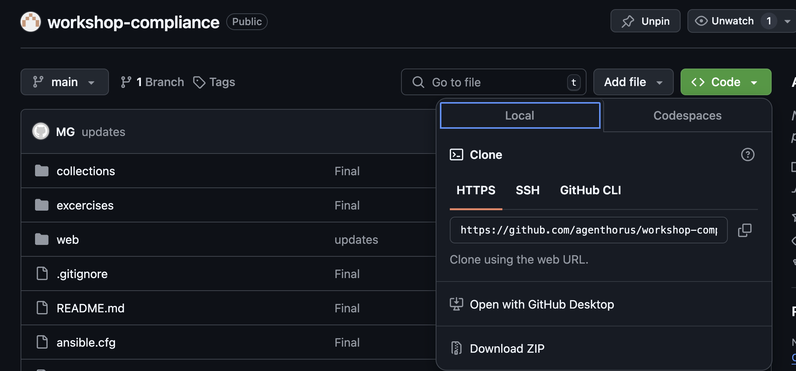
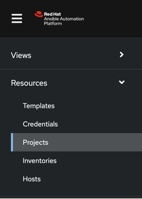
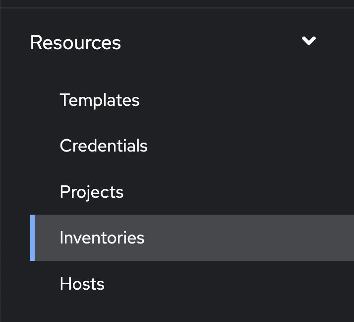
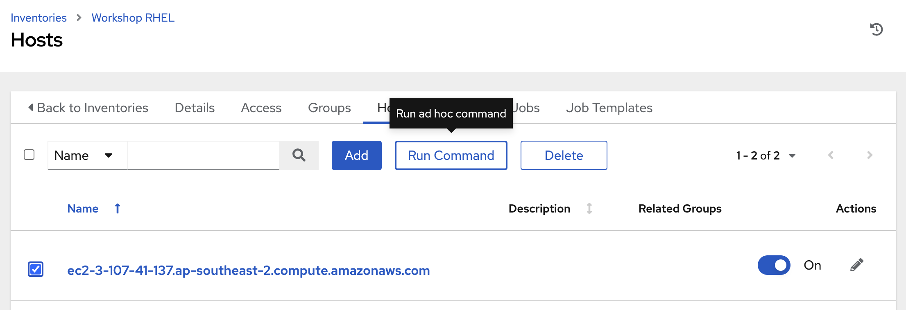
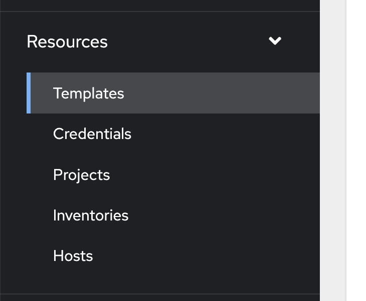
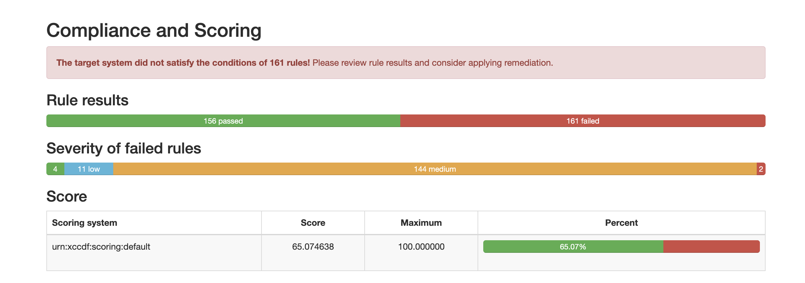

# Exercise 1: RHEL9 Compliance 


# Objective

Start setting up AAP environment by adding:
 - Examine the Code 
 - Accessing AAP
 - Configuring Projects
 - Configuring Credential
 - Configuring Inventory 
 - Validating Connectivity 
 - Configuring Compliance Job Templates 
  

# Examine the Code 

Using your preferred IDE environment (VS Code for example), clone and inspect the workshop repository , or use the browser

    https://github.com/agenthorus/workshop-compliance

Inspect the `rhel9` Security hardening playbook 

```yaml
---
- name: Apply {{ compliance_profile_id }} Benchmark security/compliance hardening to the NEW RHEL 9 VM
  hosts: all
  become: true
  become_method: sudo
  collections:
    - rhdemo.compliance

  tasks:

    - name: Apply RHEL {{ ansible_distribution_major_version }}  {{ compliance_profile_id }} Compliance Hardenning
      ansible.builtin.include_role:
        name: rhel{{ ansible_distribution_major_version }}-{{ compliance_profile_id | lower }}
        tasks_from: rhel{{ ansible_distribution_major_version }}-playbook-{{ compliance_profile_id | lower }}.yml

<snip>
```

The `collections` directive points to `rhdemo.compliance` packaged collection that includes the re-usable roles and tasks list that will be executed on the nominated clients to apply the hardening profile 


Now, inspect the roles included in the collection `rhdemo.compliance`

```bash
[lab-user@bastion compliance]$ ls -ltr roles/
total 0
drwxr-xr-x. 8 lab-user users 105 Aug 13 23:21 openscap-scanner
drwxr-xr-x. 8 lab-user users 105 Aug 13 23:21 rhel8-cis
drwxr-xr-x. 8 lab-user users 105 Aug 13 23:21 rhel9-cis
drwxr-xr-x. 8 lab-user users 105 Aug 13 23:21 rhel9-e8
drwxr-xr-x. 8 lab-user users 110 Aug 13 23:21 win2019-cis
drwxr-xr-x. 9 lab-user users 122 Aug 13 23:21 win2022-cis
```

- Role `rhel9-cis`, Apply CIS hardening for RHEL 9
- Role `rhel9-e8`, Apply E8 hardening for RHEL 9
- Role `win2022`, Apply CIS hardening for Windows 2022
- Role `openscap-scanner`, install and run the openSCAP scanner on the RHEL nodes. This can be re-used with all RHEL versions

Take some time to familiarize yourself with the code for each role and check the parameterized configuration and the controls applied. 


# Accessing AAP

login to `https://aapcontroller-aap.apps.cluster-9s6m5.9s6m5.sandbox2962.opentlc.com` and enter your login credentials

There are a number of constructs in the Automation Controller UI that enable multi-tenancy, notifications, scheduling, etc. However, we are only going to focus on a few of the key constructs that are required for this workshop today.

- Credentials

- Projects

- Inventory

- Job Template


# Create Credentials  

In order to create a project and connections to remote clients, we need to create a set of credentials

### Create a Machine Credential (Already Created)

Credentials are utilized by Controller for authentication when launching jobs against machines, synchronizing with inventory sources, and importing project content from a version control system.

There are many [types of credentials]https://docs.ansible.com/automation-controller/latest/html/userguide/credentials.html#credential-types.  including machine, network, and various cloud providers. For this workshop, we are using **machine** and **source control** credentials.

Step 1
---



**Step 2**
---

Click the **Add** icon and add new credential

**Step 3**
---


| Key | Value | Notes |
|----------|----------|----------|
| Name | RHEL Credential |  |
| Organization | Default |  |
| Credential Type | Machine |  |
| Username | ec2-user  |  |
| SSH Private Key | *Your provided key* |  |
| Privilege Escalation Method | sudo  |  |
| Privilege Escalation Username | root |  |
| Privilege Escalation Password | *ansible_password* |  |


### Create an SCM Credential
PLEASE SKIP THIS SECTION 

# Create Project

**Step 1**
---

In this environment, playbooks are stored in a git repository available on a Gitlab instance. Before a Project can be created in Automation Controller, the git URL for the repository is needed. In order to obtain the URL of your project, login to the Gitlab repository provided and copy the `https` url 



**Step 2**
---


Now, Click Projects on the left hand panel.




Step 3
---
Add new Project with the following details 


| Key | Value | Notes |
|----------|----------|----------|
| Name | Git Compliance |  |
| Description | Compliance Code |  |
| Organization | user org |  |
| SCM Type	 | Git  |  |
| SCM URL	 | https://github.com/agenthorus/workshop-compliance |  |
| SCM BRANCH	 |  | Intentionally blank |
| SCM CREDENTIAL	 | PLEASE SKIP |  |

OPTIONS

- [x] Clean
- [ ] Delete
- [ ] Track Submodules
- [x] Update revision on Launch
- [ ] Allow Branch Override


Step 4
---
Scroll down and validate that the project has been successfully synchronized against the source control repository upon saving. You should see a green icon displaying “Successful” next to the project name in the list view. If the status does not show as “Successful”, try pressing the “Sync Project” button again re-check the status.

# Create Inventory

An inventory is a collection of hosts against which jobs may be launched. Inventories are divided into groups and these groups contain hosts. Inventories may be sourced manually, by entering host names into Controller, or from one of Automation Controller’s supported cloud providers or inventory plugins from Certified Content Collections on Automation Hub.

Step 1
---
Click Inventories from the left hand panel



Click the Add icon to add new inventory

Step 2
---

Fill the form to create a new RHEL inventory as follows 

| Key | Value | Notes |
|----------|----------|----------|
| Name | Workshop RHEL |  |
| Description | RHEL servers |  |
| Organization | *User org* |  |

In the Variables Section add the following: 

```yaml
---
v_bastion_port: "22"
v_bastion_user: "*your username*"
v_bastion_pass: "*your password*"
```
>This is very important to ensure your scan jobs ships the report to your home directory in the bastion server. 

Click Save 

Step 3
---

Under your newly created inventory, go to hosts 


and Click Add (please make sure you add only the instance allocated to you as per the spreadsheet)

| Key | Value | Notes |
|----------|----------|----------|
| Name | *Public fully qualified name* or *IP Address* |  |

And Save. 


# Validating Connectivity 

To start, we will need to go to our Inventory. So click Inventories on the left panel, and then click the name of our **Workshop RHEL** Inventory. Now that you are on the Inventory Details page, we will need to go select our Host. So click HOSTS.


Next to each host is a checkbox. Check the box next to each host you want to run an ad-hoc Command on. Select the **Run Command** button.




This will pop up the Execute Command window. From here is where we can run a single task against our hosts.

Let’s start with something really basic - pinging a host. The ping module makes sure our rhel hosts are responsive. This is not a traditional ping, but actually verifying both connectivity and authentication to the host.

Fill out this form as follows

| Key | Value | Notes |
|----------|----------|----------|
| Module | `ping` |  |

Click the Next button

| Key | Value | Notes |
|----------|----------|----------|
| Execution environment	 | Default execution environment	 |  |

Click the Next button

| Key | Value | Notes |
|----------|----------|----------|
| Machine credential | Workshop Credential	 |  |

Once you click LAUNCH you will be redirected to the Job log. Every job and action in Automation Controller is recorded and stored. These logs can also be exported automatically to another logging system such as Splunk or ELK.

# Configuring Job Template to Scan pre-Hardening 


Go to the left panel and select Templates



then Click ADD and select **Add Job Template**

## Pre Scan JT

| Key | Value | Notes |
|----------|----------|----------|
| Name | JT - RHEL Scan CIS Pre |  |
| Job Type | Run |  |
| Organization | user org |  |
| Inventory	 | Workshop RHEL  |  |
| Project	 | Git Compliance |  |
| Execution Environment	 | Default Execution Environment |  |
| Playbook	 | soe-rhel-run-scan.yml |  |
| Credentials	 |  RHEL Credential |  |

Survey
| Question	 |  Answer variable name| Answer Type | Multiple Choice Options |
|----------|----------|----------|--------------|
| Compliance Profile ?| compliance_profile_id | Multiple Choice (Single Selection) | CIS and E8 |  |

Survey
| Question	 |  Answer variable name| Answer Type | Multiple Choice Options |
|----------|----------|----------|--------------|
| Compliance Profile ?| compliance_profile_id | Multiple Choice (Single Selection) | CIS <br> E8 |  |


Options
- [x] Privilege Escalation


In the Variables Section add the following: 

```yaml
---
v_stage: "preharden"
```


Now Save and Launch the Job Template 

After it is completed Successfully, inspect the job output. 


## Inspect OpenSCAP Scan Report

Login via `ssh` to the bastion server using your username:password as follows: 

```bash
ssh <username>@<*Bastion*> -p 22
```

the report will be the something similar to the following: 

`oscap-report-ip-172-16-155-219.ap-southeast-2.compute.internal-preharden.html`


copy the `html` report local to your workstation 

```bash
scp -P 22 <username>@<*Bastion*>:/home/lab-user/oscap-report-ip-172-16-155-219.ap-southeast-2.compute.internal-preharden.html .
```

and inspect the report 




# Configuring Compliance Hardening Job Template 

| Key | Value | Notes |
|----------|----------|----------|
| Name | JT - RHEL CIS Harden |  |
| Job Type | Run |  |
| Organization | user org |  |
| Inventory	 | Workshop RHEL  |  |
| Project	 | Git Compliance |  |
| Execution Environment	 | Default Execution Environment |  |
| Playbook	 | soe-rhel9-cis-hardenning.yml |  |
| Credentials	 |  RHEL Credential |  |

Survey
| Question	 |  Answer variable name| Answer Type | Multiple Choice Options |
|----------|----------|----------|--------------|
| Compliance Profile ?| compliance_profile_id | Multiple Choice (Single Selection) | CIS <br> E8 |  |

Options
- [x] Privilege Escalation


Save, Launch the Template and wait for ~10 mins for it to complete. 


# Configuring Job Template to Scan Post-Hardening 

## Post Scan JT

| Key | Value | Notes |
|----------|----------|----------|
| Name | JT - RHEL Scan CIS Post |  |
| Job Type | Run |  |
| Organization | user org |  |
| Inventory	 | Workshop RHEL  |  |
| Project	 | Git Compliance |  |
| Execution Environment	 | Default Execution Environment |  |
| Playbook	 | soe-rhel-run-scan.yml |  |
| Credentials	 |  RHEL Credential |  |


Options
- [x] Privilege Escalation


In the Variables Section add the following: 

```yaml
---
v_stage: "postharden"
```


Then follow the same steps above to copy and inspect the report Post Scanning 
